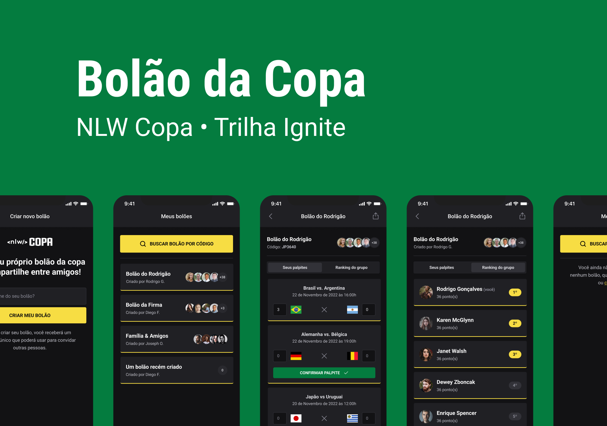

<h1 align="center">NLW Copa</h1>

<div align="center">
  
</div>

## 📜 Sobre

  Next Level Week (NLW) é um evento **online** e **gratuito** de programação na prática com muito código, desafios, networking e com o objetivo de te levar para o próximo nível.

  - Durante os dias xx e xx aconteceu a 10ª edição da NLW, o evento **NLW Copa**. Durante essa edição foi desenvolvido um projeto de palpites de jogos da copa do mundo. 

  Nessa edição, na trilha ignite, forma desenvolvidas 3 aplicações:

 - [Back-end](https://github.com/Iann-rst/nlw_copa_ignite/tree/main/server)

 - [Versão Web](https://github.com/Iann-rst/nlw_copa_ignite/tree/main/web)

 - [Versão Mobile](https://github.com/Iann-rst/nlw_copa_ignite/tree/main/mobile)

## :rocket: Como Executar?

```bash
# Faça o clone do projeto
$ git clone https://github.com/Iann-rst/NLW_copa.git

## Iniciar primeiro o servidor (server)

# BACK-END
$ cd server
#Instalar as dependências
$ npm install
#Iniciar as migrates para criação das tabelas e popular a tabela game do banco de dados
$ npx prisma migrate dev
#Executa o servidor
$ npm run dev

# FRONT-END
$ cd web
$ npm install
$ npm run dev

# MOBILE
$ cd mobile
$ npx expo start
```
