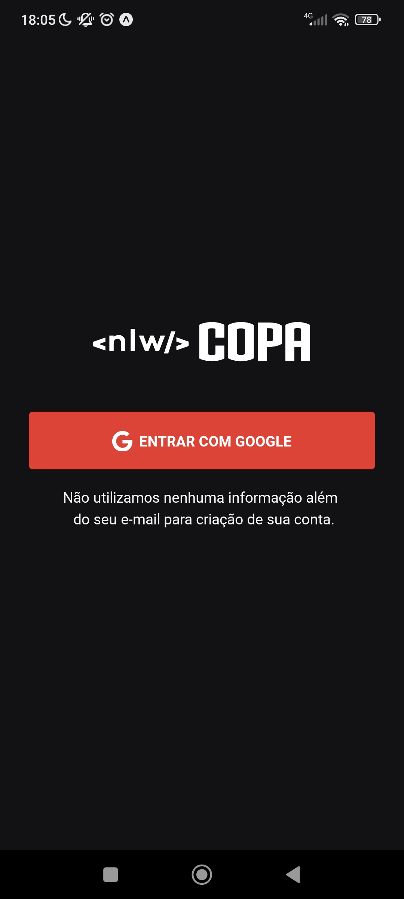
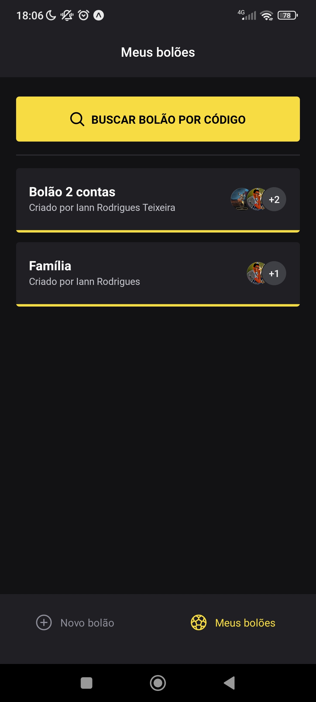
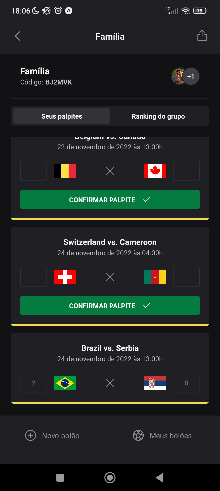

<h1 align="center">Mobile - React Native</h1>

## :man_technologist: Tecnologias utilizadas

- Criação do projeto com o Expo;
- React Native;
- Native Base;
- React Navigation - Bottom Tab Navigator;
- Phosphor Icons para o uso de ícones;

## :dart: Funcionalidades

- Autenticação do usuário com o Google;
- Consumo de API - Conexão do mobile com o back-end;
- Criação da SignIn - Tela de login OAuth com Google;
- Criação da New - Tela para criar um novo bolão;
- Criação Da Polls - Listagem dos bolões que o usuário participa;
- Criação da Find - Tela para procurar por um bolão pelo código;
- Criação da Details - Tela para mostrar os detalhes de um bolão;

## :camera: Screenshots

  

    <h3>Página SignIn - OAuth Google</h3>
    
  

  

  

    <h3>Página Criar Bolão</h3>
    
  

  

  

    <h3>Página Listar Bolão</h3>
    
  

  

  

    <h3>Procurar Bolão Por Código</h3>
    
  

  

  

    <h3>Página Detalhes Bolão e Confirmar Palpite</h3>
    
  

